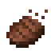

# Eating Animation

Eating Animation is a Minecraft mod for fabric loader. This is a simple client-sided mod that will add eating animation for food and potions.

#### [Discord Server](https://discord.gg/DcemWeskeZ) | [Modrinth Page](https://modrinth.com/mod/eating-animation) | [CurseForge Page](https://curseforge.com/minecraft/mc-mods/eating-animation-fabric)

## Resource Pack

Resource pack for mods included in Minecraft -> Resource packs
